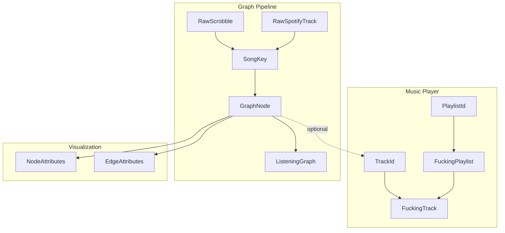

Rotations uses distinct data models for the music player and graph pipeline. This page documents all core types and their relationships.

## Music player types

The music player (site/src/shared/types.ts) defines types for local music library management.

### Identifiers

```typescript
type PlaylistId = `play-${string}`
type TrackId = `track-${string}`
```

These are branded string types that prevent mixing up IDs:

```typescript
const playlistId: PlaylistId = "play-bandcamp-ok-computer"
const trackId: TrackId = "track-bandcamp-123456"

// TypeScript prevents:
const wrong: PlaylistId = "track-something"  // Type error
```

### Playlists

```typescript
interface FuckingPlaylist {
  id: PlaylistId
  track_cover_uri: string
  name: string
  artists: string[]
  first_track: FuckingTrack
  totalDurationMs: number
  source: PlaylistSource | null
}

type PlaylistSource = "spotify" | "youtube" | "bandcamp"
```

<Note>
  Playlists store only the `first_track`. To traverse the playlist, follow the `next_tracks` chain in each track.
</Note>

### Tracks

```typescript
interface FuckingTrack {
  id: TrackId
  time_ms: number
  name: string
  artists: string[]
  tags?: string[]
  audio: AudioSource
  next_tracks?: Record<PlaylistId, TrackId>
}
```

#### Audio sources

```typescript
type AudioSource =
  | { type: "stream"; url: string }     // Direct HTTP stream (Bandcamp)
  | { type: "youtube"; id: string }     // YouTube video ID
  | { type: "spotify"; id: string }     // Spotify track ID
```

<Tabs>
  <Tab title="Bandcamp track">
    ```typescript
    const track: FuckingTrack = {
      id: "track-bandcamp-12345",
      name: "Paranoid Android",
      artists: ["Radiohead"],
      time_ms: 383000,
      audio: {
        type: "stream",
        url: "https://t4.bcbits.com/stream/abc123/mp3-128/12345"
      },
      next_tracks: {
        "play-ok-computer": "track-bandcamp-12346"
      }
    }
    ```
  </Tab>
  
  <Tab title="YouTube track">
    ```typescript
    const track: FuckingTrack = {
      id: "track-youtube-dQw4w9WgXcQ",
      name: "Never Gonna Give You Up",
      artists: ["Rick Astley"],
      time_ms: 212000,
      audio: {
        type: "youtube",
        id: "dQw4w9WgXcQ"
      }
    }
    ```
  </Tab>
  
  <Tab title="Spotify track">
    ```typescript
    const track: FuckingTrack = {
      id: "track-spotify-6LgJvl0Xdtc73RJ1mmpotq",
      name: "Paranoid Android",
      artists: ["Radiohead"],
      time_ms: 383000,
      audio: {
        type: "spotify",
        id: "6LgJvl0Xdtc73RJ1mmpotq"
      },
      next_tracks: {
        "play-spotify-37i9dQZF1DXcBWIGoYBM5M": "track-spotify-3ZXb..."
      }
    }
    ```
  </Tab>
</Tabs>

### Player state

```typescript
interface PlayerState {
  activePlaylist: PlaylistId
  activeTrack: TrackId
  trackTimestamp: number        // Milliseconds
  lastPlaylistId: PlaylistId
}
```

This state is persisted to localStorage via TinyBase and restored on page load.

## Graph pipeline types

The graph pipeline (graph-pipeline/src/graph/types.ts) defines types for listening history analysis.

### Song key

```typescript
type SongKey = `${string}::${string}`

function toSongKey(artist: string, track: string): SongKey {
  return `${artist.toLowerCase().trim()}::${track.toLowerCase().trim()}`
}
```

The `SongKey` is the canonical identifier for songs in the graph:

```typescript
toSongKey("Radiohead", "Paranoid Android")  
// → "radiohead::paranoid android"

toSongKey("radiohead", "PARANOID ANDROID")  
// → "radiohead::paranoid android" (same key)
```

<Info>
  `SongKey` enables cross-source matching. The same song from Last.fm and Spotify will resolve to the same key despite minor formatting differences.
</Info>

### Graph node

```typescript
interface GraphNode {
  // Song metadata
  name: string
  artists: string[]
  albumName?: string
  spotifyId?: string
  lastfmUrl?: string
  imageUrl?: string
  
  // Graph structure
  next: Record<SongKey, number>
  previous: Record<SongKey, number>
  
  // Statistics
  totalPlays: number
  sources: ListeningSource[]
  sourcePlays?: Partial<Record<ListeningSource, number>>
  playDates: string[]           // ISO 8601 timestamps, sorted
  
  // Analysis results
  pageRank?: number
  clusterId?: number
  
  // Optional link back to music player
  trackId?: TrackId
}

type ListeningSource = "lastfm" | "spotify-recent" | "spotify-playlist"
```

<Accordion title="Example GraphNode">
  ```typescript
  const node: GraphNode = {
    name: "Paranoid Android",
    artists: ["Radiohead"],
    albumName: "OK Computer",
    spotifyId: "6LgJvl0Xdtc73RJ1mmpotq",
    imageUrl: "https://i.scdn.co/image/ab67616d0000b273c8b444df094279e70d0ed856",
    
    // Outgoing edges (next songs)
    next: {
      "radiohead::subterranean homesick alien": 12,
      "radiohead::exit music (for a film)": 3,
      "ok go::here it goes again": 1
    },
    
    // Incoming edges (previous songs)
    previous: {
      "radiohead::airbag": 10,
      "radiohead::let down": 2,
      "muse::supermassive black hole": 1
    },
    
    totalPlays: 47,
    sources: ["lastfm", "spotify-playlist"],
    sourcePlays: {
      "lastfm": 42,
      "spotify-playlist": 5
    },
    
    playDates: [
      "2023-01-15T14:23:00Z",
      "2023-01-20T09:12:00Z",
      "2023-02-03T18:45:00Z",
      // ... (chronologically sorted)
    ],
    
    pageRank: 0.00234,
    clusterId: 7
  }
  ```
</Accordion>

### Edge interpretation

Edges are directed and weighted:

```typescript
// If nodeA.next[keyB] = 5, it means:
// "Song A was followed by Song B 5 times"

// The reverse is also stored:
// nodeB.previous[keyA] = 5
// "Song B was preceded by Song A 5 times"
```

<Note>
  Both `next` and `previous` are maintained to enable efficient bidirectional traversal without scanning all nodes.
</Note>

### Listening graph

```typescript
interface ListeningGraph {
  nodes: Record<SongKey, GraphNode>
  metadata: GraphMetadata
}

interface GraphMetadata {
  totalScrobbles: number
  dateRange: { from: string; to: string }
  exportTimestamp: string
  lastfmUsername?: string
  spotifyUsername?: string
}
```

<Accordion title="Example ListeningGraph">
  ```json
  {
    "nodes": {
      "radiohead::paranoid android": {
        "name": "Paranoid Android",
        "artists": ["Radiohead"],
        "next": { "radiohead::subterranean homesick alien": 12 },
        "previous": { "radiohead::airbag": 10 },
        "totalPlays": 47,
        "sources": ["lastfm"],
        "playDates": ["2023-01-15T14:23:00Z"],
        "pageRank": 0.00234,
        "clusterId": 7
      },
      "radiohead::subterranean homesick alien": {
        // ...
      }
    },
    "metadata": {
      "totalScrobbles": 87543,
      "dateRange": {
        "from": "2018-06-12T10:23:00Z",
        "to": "2024-02-28T22:15:00Z"
      },
      "exportTimestamp": "2024-02-29T08:00:00Z",
      "lastfmUsername": "example_user"
    }
  }
  ```
</Accordion>

### Raw ingestion types

Types for data as it comes from external APIs:

<Tabs>
  <Tab title="Last.fm">
    ```typescript
    interface RawScrobble {
      artist: string
      track: string
      album: string
      timestamp: number      // Unix timestamp (seconds)
      imageUrl?: string
    }
    ```
  </Tab>
  
  <Tab title="Spotify recent">
    ```typescript
    interface RawSpotifyRecentTrack {
      spotifyId: string
      artist: string
      track: string
      album: string
      playedAt: string       // ISO 8601 timestamp
      imageUrl?: string
    }
    ```
  </Tab>
  
  <Tab title="Spotify playlist">
    ```typescript
    interface RawSpotifyPlaylistTrack {
      spotifyId: string
      artist: string
      track: string
      album: string
      playlistId: string     // Spotify playlist ID
      playlistName: string
      position: number       // Zero-based position
      imageUrl?: string
    }
    ```
  </Tab>
</Tabs>

## Graph analysis types

### PageRank

```typescript
interface PageRankOptions {
  dampingFactor?: number           // Default: 0.85
  convergenceThreshold?: number    // Default: 0.0001
  maxIterations?: number           // Default: 100
}

interface PageRankResult {
  iterations: number
  converged: boolean
  maxDelta: number
}
```

PageRank scores are written to `GraphNode.pageRank`:

```typescript
// Higher score = more central/important in listening patterns
node.pageRank = 0.00234  // Typical range: 0.0001 - 0.01
```

### Clustering

```typescript
interface ClusterResult {
  clusterCount: number
  modularity: number
  clusters: ClusterStats[]
}

interface ClusterStats {
  clusterId: number
  size: number                    // Number of songs in cluster
  topSongs: Array<{
    songKey: SongKey
    name: string
    artists: string[]
    totalPlays: number
  }>
  interClusterEdges: number       // Edges to other clusters
}
```

Cluster IDs are written to `GraphNode.clusterId`:

```typescript
node.clusterId = 7  // Songs with same ID are in same community
```

### Path finding

```typescript
interface PathResult {
  from: SongKey
  to: SongKey
  found: boolean
  algorithm: "shortest" | "strongest"
  path: PathStep[]
  hops: number
  totalWeight: number
  minEdgeWeight: number
}

interface PathStep {
  songKey: SongKey
  name: string
  artists: string[]
  edgeWeight?: number    // Weight of edge TO this node
}
```

<Accordion title="Example path result">
  ```json
  {
    "from": "radiohead::paranoid android",
    "to": "pink floyd::comfortably numb",
    "found": true,
    "algorithm": "strongest",
    "hops": 3,
    "totalWeight": 47,
    "minEdgeWeight": 8,
    "path": [
      {
        "songKey": "radiohead::paranoid android",
        "name": "Paranoid Android",
        "artists": ["Radiohead"]
      },
      {
        "songKey": "radiohead::exit music (for a film)",
        "name": "Exit Music (For a Film)",
        "artists": ["Radiohead"],
        "edgeWeight": 12
      },
      {
        "songKey": "pink floyd::wish you were here",
        "name": "Wish You Were Here",
        "artists": ["Pink Floyd"],
        "edgeWeight": 15
      },
      {
        "songKey": "pink floyd::comfortably numb",
        "name": "Comfortably Numb",
        "artists": ["Pink Floyd"],
        "edgeWeight": 20
      }
    ]
  }
  ```
</Accordion>

## Visualization types

The graph frontend uses graphology for rendering. Types are defined in graph-frontend/src/lib/types.ts:

```typescript
interface NodeAttributes {
  label: string
  artists: string[]
  albumName?: string
  spotifyId?: string
  lastfmUrl?: string
  imageUrl?: string
  totalPlays: number
  sources: string[]
  pageRank: number
  playDates: string[]
  
  // Rendering attributes
  size: number
  color: string
  x: number
  y: number
}

interface EdgeAttributes {
  weight: number
  size: number
  color: string
}
```

These attributes are computed from `GraphNode` during conversion:

```typescript
function toGraphology(graph: ListeningGraph): Graph<NodeAttributes, EdgeAttributes> {
  const g = new Graph<NodeAttributes, EdgeAttributes>()
  
  for (const [key, node] of Object.entries(graph.nodes)) {
    g.addNode(key, {
      label: `${node.artists[0]} — ${node.name}`,
      size: computeSize(node.totalPlays),
      color: computeColor(node.pageRank),
      x: Math.random() * 1000,
      y: Math.random() * 1000,
      // ... other attributes
    })
  }
  
  return g
}
```

## Type relationships



### Cross-component linking

The graph pipeline can optionally link back to the music player:

```typescript
interface GraphNode {
  // ...
  trackId?: TrackId  // Link to local music library
}
```

This allows you to:

1. Explore listening patterns in the graph visualization
2. Click a node to jump to that track in the music player

However, this is optional — the two systems are otherwise independent.

## Storage formats

<AccordionGroup>
  <Accordion title="TinyBase (music player)">
    Stored in `localStorage` as JSON:

    ```json
    {
      "playlists": {
        "play-bandcamp-ok-computer": {
          "id": "play-bandcamp-ok-computer",
          "name": "OK Computer",
          "artists": "[\"Radiohead\"]",
          "first_track_id": "track-bandcamp-12345",
          "source": "bandcamp"
        }
      },
      "tracks": {
        "track-bandcamp-12345": {
          "id": "track-bandcamp-12345",
          "name": "Airbag",
          "artists": "[\"Radiohead\"]",
          "stream_url": "{\"type\":\"stream\",\"url\":\"https://...\"}",
          "next_tracks": "{\"play-bandcamp-ok-computer\":\"track-bandcamp-12346\"}"
        }
      },
      "values": {
        "activePlaylist": "play-bandcamp-ok-computer",
        "activeTrack": "track-bandcamp-12345",
        "trackTimestamp": 45000
      }
    }
    ```
  </Accordion>
  
  <Accordion title="SQLite (graph pipeline)">
    Nodes table:

    ```sql
    SELECT song_key, data FROM nodes LIMIT 1;
    ```

    Result:
    ```
    song_key: radiohead::paranoid android
    data: {"name":"Paranoid Android","artists":["Radiohead"],...}
    ```

    The entire `GraphNode` is serialized as JSON in the `data` column.
  </Accordion>
  
  <Accordion title="IndexedDB (music cache)">
    Object store: `musicCache`
    Key: `TrackId`
    Value: `Blob` (audio data)

    ```typescript
    // Stored structure
    {
      key: "track-bandcamp-12345",
      value: Blob(3.2 MB, audio/mpeg)
    }
    ```
  </Accordion>
</AccordionGroup>

## Type safety

### Branded types

Both `TrackId` and `PlaylistId` are branded strings:

```typescript
type PlaylistId = `play-${string}`

// Valid:
const id: PlaylistId = "play-bandcamp-ok-computer"

// Invalid (compile error):
const bad: PlaylistId = "playlist-123"  // Wrong prefix
const wrong: PlaylistId = "track-123"   // Wrong type
```

This prevents accidentally passing a `TrackId` where a `PlaylistId` is expected.

### SongKey validation

The `SongKey` type enforces the `artist::track` format:

```typescript
type SongKey = `${string}::${string}`

// Valid:
const key: SongKey = "radiohead::paranoid android"

// Invalid (compile error):
const bad: SongKey = "radiohead-paranoid-android"  // Missing ::
```

### Runtime validation

The API validates `SongKey` format at runtime:

```typescript
function parseSongKey(rawKey: string): SongKey {
  const decoded = decodeURIComponent(rawKey)
  if (!decoded || !decoded.includes("::")) {
    throw {
      error: "Invalid songKey format. Expected: artist::track",
      status: 400
    }
  }
  return decoded as SongKey
}
```

## Next steps

<CardGroup cols={3}>
  <Card title="Architecture overview" icon="diagram-project" href="/architecture/overview">
    High-level system design
  </Card>
  <Card title="Music player" icon="play" href="/architecture/music-player">
    Frontend implementation details
  </Card>
  <Card title="Graph pipeline" icon="sitemap" href="/architecture/graph-pipeline">
    Backend implementation details
  </Card>
</CardGroup>