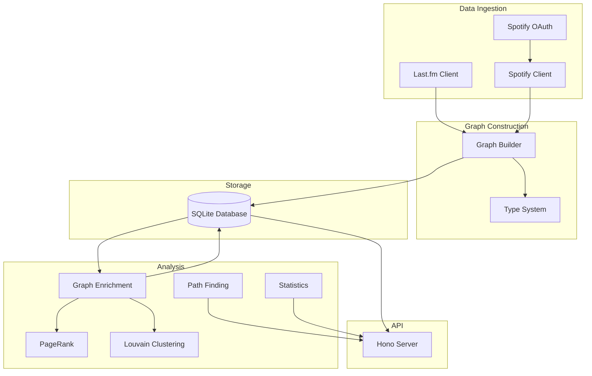

The graph pipeline (`graph-pipeline/`) is a standalone backend service that ingests listening history from multiple sources, constructs a directed weighted graph, and provides a REST API for querying the data.

## Architecture overview



## Data ingestion

The pipeline can ingest listening history from multiple sources and merge them into a unified graph.

### Last.fm ingestion

The `LastfmClient` (graph-pipeline/src/ingestion/lastfm-client.ts) fetches scrobble history:

```typescript
interface RawScrobble {
  artist: string
  track: string
  album: string
  timestamp: number      // Unix timestamp (seconds)
  imageUrl?: string
}
```

Fetching strategy:

1. Call `user.getRecentTracks` API endpoint
2. Paginate through history (200 tracks per page)
3. Rate limit to 1 request per second (Last.fm max: 5/sec)
4. Extract artist, track, album, timestamp from each scrobble
5. Save raw scrobbles to `data/lastfm-scrobbles.json`

<Accordion title="Example Last.fm fetch">
  ```typescript
  const client = new LastfmClient({ apiKey, username })
  await client.verifyAuth()

  const scrobbles = await fetchLastfmScrobbles(client, {
    onProgress: (msg) => console.log(msg)
  })
  // Returns: RawScrobble[]
  // Typical history: 10,000 - 100,000+ scrobbles
  ```
</Accordion>

### Spotify ingestion

Spotify provides two data sources: recently played tracks and playlists.

#### Recently played

The `SpotifyClient` (graph-pipeline/src/ingestion/spotify-client.ts) fetches recent listening history:

```typescript
interface RawSpotifyRecentTrack {
  spotifyId: string
  artist: string
  track: string
  album: string
  playedAt: string       // ISO 8601 timestamp
  imageUrl?: string
}
```

Limitation: Spotify's `/v1/me/player/recently-played` endpoint only returns the last 50 tracks.

#### Playlists

The client also fetches all user playlists and their track orderings:

```typescript
interface RawSpotifyPlaylistTrack {
  spotifyId: string
  artist: string
  track: string
  album: string
  playlistId: string     // Spotify playlist ID
  playlistName: string
  position: number       // Zero-based position in playlist
  imageUrl?: string
}
```

Process:

1. Fetch all user playlists via `/v1/me/playlists`
2. For each playlist, fetch all tracks via `/v1/playlists/{id}/tracks`
3. Paginate through tracks (100 per page)
4. Save raw data to `data/spotify-dump.json`

<Info>
  Spotify OAuth requires `user-read-recently-played`, `playlist-read-private`, and `playlist-read-collaborative` scopes.
</Info>

### Spotify authentication

The `SpotifyAuth` class (graph-pipeline/src/ingestion/spotify-auth.ts) handles OAuth 2.0 flow:

```typescript
class SpotifyAuth {
  async authorize(): Promise<void>
  async refresh(): Promise<void>
  async hasTokens(): Promise<boolean>
  async getAccessToken(): Promise<string>
}
```

<Tabs>
  <Tab title="Authorization flow">
    1. Generate PKCE challenge and state
    2. Open browser to Spotify authorization URL
    3. User grants permissions
    4. Spotify redirects to localhost callback
    5. Exchange authorization code for access + refresh tokens
    6. Save tokens to `data/spotify-tokens.json`
  </Tab>
  
  <Tab title="Token refresh">
    Access tokens expire after 1 hour. The client automatically:
    
    1. Checks token expiration before each request
    2. If expired, calls `/api/token` with refresh token
    3. Receives new access token
    4. Updates stored tokens
  </Tab>
</Tabs>

## Graph construction

The `buildGraph` function (graph-pipeline/src/graph/build-graph.ts:241) accepts raw data from all sources and constructs a unified graph.

### Song key normalization

All songs are identified by a canonical `SongKey`:

```typescript
type SongKey = `${string}::${string}`  // "artist::track"

function toSongKey(artist: string, track: string): SongKey {
  return `${artist.toLowerCase().trim()}::${track.toLowerCase().trim()}`
}
```

This enables cross-source matching:

- Last.fm: "Radiohead" + "Paranoid Android"
- Spotify: "radiohead" + "Paranoid Android"
- Both resolve to: `"radiohead::paranoid android"`

### Edge creation

Edges represent sequential transitions between songs.

#### From scrobble history

Scrobbles are sorted chronologically. For each consecutive pair:

```typescript
for (let i = 0; i < scrobbles.length - 1; i++) {
  const from = scrobbles[i]
  const to = scrobbles[i + 1]
  
  // Only create edge if played within 1 hour
  if (to.timestamp - from.timestamp <= 3600) {
    addEdge(nodes, toSongKey(from.artist, from.track), 
                   toSongKey(to.artist, to.track))
  }
}
```

The 1-hour gap threshold prevents spurious edges when listening sessions are interrupted.

#### From playlist orderings

Playlist tracks are sorted by position. Consecutive tracks always get an edge:

```typescript
const sorted = playlistTracks.sort((a, b) => a.position - b.position)

for (let i = 0; i < sorted.length - 1; i++) {
  addEdge(nodes, 
          toSongKey(sorted[i].artist, sorted[i].track),
          toSongKey(sorted[i + 1].artist, sorted[i + 1].track))
}
```

### Weighted edges

Edges are weighted by frequency. If song A was followed by song B three times:

```typescript
const nodeA: GraphNode = {
  // ...
  next: {
    "b::song b": 3  // A → B occurred 3 times
  }
}

const nodeB: GraphNode = {
  // ...
  previous: {
    "a::song a": 3  // B ← A occurred 3 times
  }
}
```

Both `next` and `previous` are maintained for efficient traversal in both directions.

### Graph builder output

The builder returns a `ListeningGraph` (graph-pipeline/src/graph/types.ts:77):

```typescript
interface ListeningGraph {
  nodes: Record<SongKey, GraphNode>
  metadata: GraphMetadata
}

interface GraphMetadata {
  totalScrobbles: number
  dateRange: { from: string; to: string }
  exportTimestamp: string
  lastfmUsername?: string
  spotifyUsername?: string
}
```

<Accordion title="Example graph node">
  ```typescript
  const node: GraphNode = {
    name: "Paranoid Android",
    artists: ["Radiohead"],
    albumName: "OK Computer",
    spotifyId: "6LgJvl0Xdtc73RJ1mmpotq",
    imageUrl: "https://i.scdn.co/image/ab67616d0000b273...",
    
    next: {
      "radiohead::subterranean homesick alien": 12,
      "radiohead::exit music (for a film)": 3
    },
    previous: {
      "radiohead::airbag": 10,
      "radiohead::let down": 2
    },
    
    totalPlays: 47,
    sources: ["lastfm", "spotify-playlist"],
    sourcePlays: {
      "lastfm": 42,
      "spotify-playlist": 5
    },
    
    playDates: [
      "2023-01-15T14:23:00Z",
      "2023-01-20T09:12:00Z",
      // ... (chronologically sorted)
    ],
    
    pageRank: 0.00234,
    clusterId: 7
  }
  ```
</Accordion>

## Graph analysis

Once the graph is constructed, multiple analysis algorithms enrich it with insights.

### PageRank

The `computePageRank` function (graph-pipeline/src/analysis/pagerank.ts:35) ranks songs by importance.

#### Algorithm

PageRank treats the listening graph as a Markov chain:

1. Initialize all nodes with rank `1/N`
2. For each iteration:
   - Dangling nodes (no outgoing edges) distribute rank evenly
   - Each node distributes rank to neighbors proportional to edge weight
   - Apply damping factor: `rank = (1-d)/N + d * (incoming_rank)`
3. Stop when converged or max iterations reached

```typescript
computePageRank(graph, {
  dampingFactor: 0.85,
  convergenceThreshold: 0.0001,
  maxIterations: 100
})
// Mutates graph in place, setting node.pageRank
```

<Info>
  Higher PageRank means the song is frequently transitioned to from many other songs. It captures both popularity (many plays) and centrality (many connections).
</Info>

#### Weighted distribution

Unlike standard PageRank, this implementation uses edge weights:

```typescript
// Node A has two outgoing edges:
// A → B (weight: 5)
// A → C (weight: 1)

// A distributes its rank proportionally:
const outSum = 5 + 1  // = 6
const contributionToB = (rankA * 5) / 6  // 83% of rank
const contributionToC = (rankA * 1) / 6  // 17% of rank
```

### Clustering

The `detectClusters` function (graph-pipeline/src/analysis/clusters.ts:33) finds communities using the Louvain method.

#### Algorithm

Louvain optimizes modularity in two phases:

**Phase 1: Local optimization**

1. Start with each node in its own cluster
2. For each node, calculate modularity gain from moving to each neighbor's cluster
3. Move node to the cluster with the best gain
4. Repeat until no improvement

**Modularity formula:**

```
ΔQ = k_i,in / m - (Σ_tot * k_i) / (2m²)
```

Where:
- `k_i,in` = weight from node i to target cluster
- `m` = total edge weight in graph
- `Σ_tot` = sum of degrees in target cluster
- `k_i` = degree of node i

<Note>
  The implementation treats edges as undirected for clustering (sum of `next` + `previous` weights) since communities are about mutual affinity, not direction.
</Note>

#### Cluster output

Each node is assigned a `clusterId`:

```typescript
interface ClusterResult {
  clusterCount: number
  modularity: number
  clusters: ClusterStats[]
}

interface ClusterStats {
  clusterId: number
  size: number                    // Number of songs
  topSongs: Array<{
    songKey: SongKey
    name: string
    artists: string[]
    totalPlays: number
  }>
  interClusterEdges: number       // Connections to other clusters
}
```

Clusters often correspond to:

- Albums you listen to front-to-back
- Artists with similar styles
- Genres you listen to together
- Mood-based listening patterns

### Path finding

The pipeline provides two pathfinding algorithms (graph-pipeline/src/analysis/paths.ts):

<Tabs>
  <Tab title="Shortest path">
    Breadth-first search to find the minimum number of hops:

    ```typescript
    shortestPath(graph, 
      "radiohead::paranoid android",
      "the beatles::a day in the life"
    )
    // Returns: { path: [...], hops: 4, found: true }
    ```

    Example result:
    ```
    Radiohead — Paranoid Android
      → Radiohead — Exit Music
      → Pink Floyd — Comfortably Numb
      → Pink Floyd — Time
      → The Beatles — A Day in the Life
    ```
  </Tab>
  
  <Tab title="Strongest path">
    Dijkstra's algorithm to find the path with highest minimum edge weight:

    ```typescript
    strongestPath(graph,
      "radiohead::paranoid android",
      "the beatles::a day in the life"
    )
    // Returns: { path: [...], minEdgeWeight: 12, totalWeight: 87 }
    ```

    Finds the path where you most naturally transition through songs based on listening habits.
  </Tab>
</Tabs>

### Statistics

The `computeStats` function (graph-pipeline/src/analysis/stats.ts) calculates graph metrics:

```typescript
interface GraphStats {
  nodeCount: number
  edgeCount: number
  avgDegree: number
  maxInDegree: { songKey: SongKey; degree: number }
  maxOutDegree: { songKey: SongKey; degree: number }
  mostPlayed: Array<{ songKey: SongKey; plays: number }>
}
```

## Database storage

The `GraphDatabase` class (graph-pipeline/src/graph/database.ts) wraps SQLite with a graph-specific API.

### Schema

```sql
CREATE TABLE nodes (
  song_key TEXT PRIMARY KEY,
  data TEXT NOT NULL  -- JSON serialized GraphNode
)

CREATE TABLE metadata (
  key TEXT PRIMARY KEY,
  value TEXT NOT NULL
)
```

The entire `GraphNode` is stored as JSON in the `data` column for simplicity.

### API methods

```typescript
class GraphDatabase {
  // Graph operations
  saveGraph(graph: ListeningGraph): void
  loadGraph(): ListeningGraph
  clearGraph(): void
  
  // Node operations
  getNode(key: SongKey): GraphNode | null
  updateNode(key: SongKey, node: GraphNode): void
  
  // Queries
  getNodeCount(): number
  getEdgeCount(): number
  getTopByPlays(limit: number): GraphNode[]
  getTopByPageRank(limit: number): GraphNode[]
}
```

<Accordion title="Why SQLite?">
  SQLite provides:
  
  - **Simple deployment**: Single file, no server process
  - **ACID transactions**: Safe concurrent access
  - **Fast queries**: Indexed lookups by song key
  - **Portability**: Database file can be backed up or shared
  
  The graph typically has 1,000-10,000 nodes, well within SQLite's performance range.
</Accordion>

## REST API

The `createApp` function (graph-pipeline/src/server/app.ts:49) creates a Hono server with the following routes:

### Query routes

<AccordionGroup>
  <Accordion title="GET /graph">
    Returns the full graph with optional pagination:

    ```bash
    GET /graph?limit=100&offset=0
    ```

    Response:
    ```json
    {
      "nodes": {
        "radiohead::paranoid android": { /* GraphNode */ },
        // ...
      },
      "metadata": { /* GraphMetadata */ },
      "pagination": {
        "total": 3450,
        "offset": 0,
        "limit": 100,
        "hasMore": true
      }
    }
    ```
  </Accordion>
  
  <Accordion title="GET /graph/node/:songKey">
    Returns a single node with all edges:

    ```bash
    GET /graph/node/radiohead%3A%3Aparanoid%20android
    ```

    Response includes `next` and `previous` edge weights.
  </Accordion>
  
  <Accordion title="GET /graph/neighbors/:songKey">
    Returns immediate neighbors with full node data:

    ```json
    {
      "songKey": "radiohead::paranoid android",
      "node": { /* GraphNode */ },
      "next": {
        "radiohead::subterranean homesick alien": {
          "node": { /* GraphNode */ },
          "weight": 12
        }
      },
      "previous": { /* ... */ }
    }
    ```
  </Accordion>
  
  <Accordion title="GET /graph/stats">
    Returns summary statistics:

    ```json
    {
      "totalNodes": 3450,
      "totalEdges": 12890,
      "metadata": { /* GraphMetadata */ }
    }
    ```
  </Accordion>
  
  <Accordion title="GET /graph/analysis">
    Returns full analysis including PageRank top songs, cluster summaries, and statistics:

    ```bash
    GET /graph/analysis?topN=20
    ```
  </Accordion>
  
  <Accordion title="GET /graph/path">
    Finds a path between two songs:

    ```bash
    GET /graph/path?from=radiohead::paranoid+android&to=beatles::a+day+in+the+life&algorithm=strongest
    ```
  </Accordion>
</AccordionGroup>

### Pipeline routes

Routes for running the data pipeline:

<AccordionGroup>
  <Accordion title="POST /pipeline/spotify/auth">
    Initiates Spotify OAuth flow. Opens browser for authorization.
  </Accordion>
  
  <Accordion title="POST /pipeline/fetch/lastfm">
    Fetches scrobbles from Last.fm and saves to `data/lastfm-scrobbles.json`.
  </Accordion>
  
  <Accordion title="POST /pipeline/fetch/spotify">
    Fetches recently played + playlists from Spotify and saves to `data/spotify-dump.json`.
  </Accordion>
  
  <Accordion title="POST /pipeline/build">
    Builds graph from fetched data, runs analysis, and saves to database.
  </Accordion>
  
  <Accordion title="POST /pipeline/run">
    Runs the full pipeline end-to-end (Last.fm fetch + Spotify fetch + build).
  </Accordion>
</AccordionGroup>

## Configuration

The pipeline is configured via environment variables (graph-pipeline/src/config.ts):

```bash
# Last.fm credentials
LASTFM_API_KEY=your_lastfm_api_key
LASTFM_USERNAME=your_lastfm_username

# Spotify credentials
SPOTIFY_CLIENT_ID=your_spotify_client_id
SPOTIFY_CLIENT_SECRET=your_spotify_client_secret

# Database path
DB_PATH=./data/graph.db

# Server port
PORT=3001
```

## Running the pipeline

### CLI usage

The pipeline can be run from the command line:

```bash
cd graph-pipeline

# Install dependencies
npm install

# Fetch Last.fm scrobbles
npm run fetch:lastfm

# Authorize Spotify (opens browser)
npm run auth:spotify

# Fetch Spotify data
npm run fetch:spotify

# Build and analyze graph
npm run build:graph

# Start API server
npm run start
```

### Server mode

Run as a long-lived server:

```bash
npm run start
# Server listens on http://localhost:3001
```

Then trigger pipeline operations via API:

```bash
curl -X POST http://localhost:3001/pipeline/run
```

## Performance characteristics

<AccordionGroup>
  <Accordion title="Ingestion performance">
    **Last.fm:**
    - 100,000 scrobbles ≈ 500 API requests (200 per page)
    - Rate limit: 1 req/sec = ~8 minutes
    - Memory: < 100 MB for raw scrobbles

    **Spotify:**
    - Recently played: 1 request (50 tracks)
    - Playlists: 1 request per playlist + 1 per 100 tracks
    - 50 playlists with 2,000 tracks total ≈ 70 requests
    - No explicit rate limit, completes in ~30 seconds
  </Accordion>
  
  <Accordion title="Graph construction">
    - 100,000 scrobbles → ~5,000-10,000 unique songs
    - Build time: ~5-10 seconds
    - Memory peak: ~200 MB
    - Bottleneck: Edge aggregation for duplicate transitions
  </Accordion>
  
  <Accordion title="Analysis performance">
    **PageRank:**
    - 10,000 nodes, 50,000 edges
    - Converges in ~20-40 iterations
    - Time: ~1-2 seconds

    **Clustering:**
    - Same graph
    - Louvain typically completes in 5-10 passes
    - Time: ~2-4 seconds

    **Total enrichment time:** ~5-10 seconds for typical graph
  </Accordion>
  
  <Accordion title="Database performance">
    - SQLite write: ~0.5 seconds for 10,000 nodes (single transaction)
    - SQLite read: ~0.1 seconds to load full graph
    - Database file size: ~2-5 MB for 10,000 nodes
  </Accordion>
</AccordionGroup>

## Next steps

<CardGroup cols={2}>
  <Card title="Data model" icon="database" href="/architecture/data-model">
    Detailed type definitions and schemas
  </Card>
  <Card title="Music player architecture" icon="play" href="/architecture/music-player">
    Learn about the frontend player
  </Card>
</CardGroup>