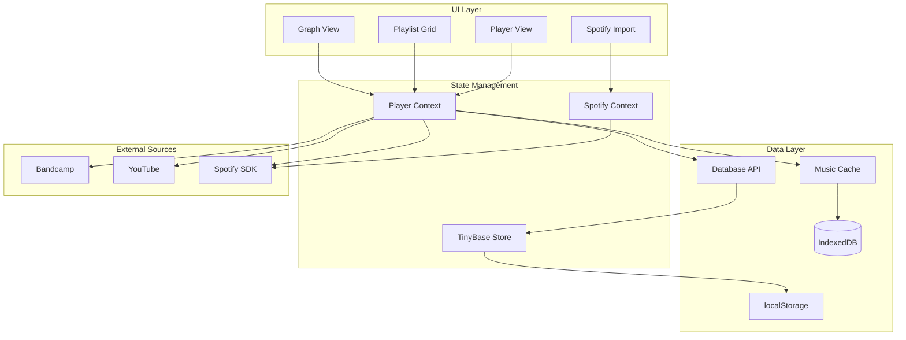
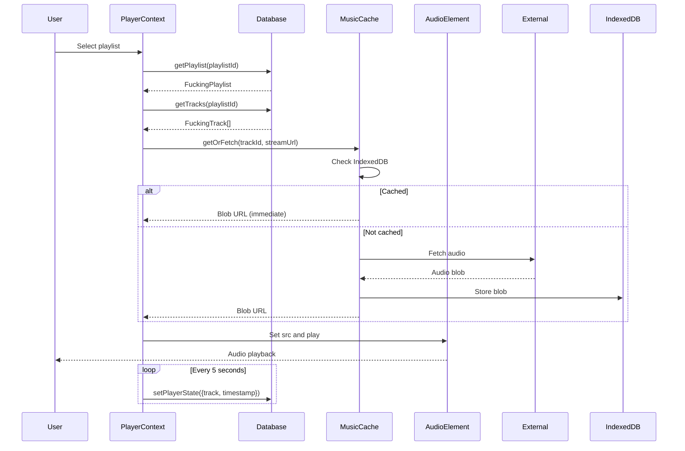

The music player (`site/`) is the primary interface for listening to music in Rotations. It's a frontend-only Astro application with React components that stores everything locally in your browser.

## Architecture overview



## Core components

### Player context

The `PlayerContext` (site/src/hooks/PlayerContext.tsx:20) is the central state manager for music playback:

```typescript
interface PlayerContextValue {
  playlist?: FuckingPlaylist
  tracks: FuckingTrack[]
  currentTrackIndex: number
  currentTimeMs: number
  isPlaying: boolean
  currentTrack: FuckingTrack | null
  
  togglePlayPause: () => void
  handleSeek: (value: number) => void
  handleTrackSelect: (index: number) => Promise<void>
  handleNextTrack: () => Promise<void>
  handlePrevTrack: () => Promise<void>
  
  addPlaylists: (playlists: FuckingPlaylist[]) => void
  addTracks: (tracks: FuckingTrack[], playlistId: PlaylistId) => void
}
```

It manages:

- Current playback state (track, time, playing/paused)
- Audio element lifecycle
- Spotify SDK integration for Spotify playlists
- Persisting player state to TinyBase

### TinyBase store

TinyBase is a reactive data store that automatically persists to localStorage. The schema is defined in site/src/lib/store.ts:14:

```typescript
const store = createStore()
  .setTablesSchema({
    playlists: {
      id: { type: "string" },
      track_cover_uri: { type: "string" },
      name: { type: "string" },
      artists: { type: "string" }, // JSON array
      first_track_id: { type: "string" },
      source: { type: "string" },
    },
    tracks: {
      id: { type: "string" },
      playlist_id: { type: "string" },
      time_ms: { type: "number" },
      name: { type: "string" },
      artists: { type: "string" }, // JSON array
      tags: { type: "string" }, // JSON array
      stream_url: { type: "string" },
      next_tracks: { type: "string" }, // JSON Record
    },
  })
  .setValuesSchema({
    activePlaylist: { type: "string", default: "" },
    activeTrack: { type: "string", default: "" },
    trackTimestamp: { type: "number", default: 0 },
    lastPlaylistId: { type: "string", default: "" },
  })
```

The `Database` class (site/src/lib/store.ts:46) wraps TinyBase with a type-safe API:

<Accordion title="Database methods">
  ```typescript
  class Database {
    async init(): Promise<void>
    
    // Player state
    getPlayerState(): PlayerState | undefined
    setPlayerState(state: Partial<PlayerState>): void
    
    // Playlists
    getPlaylist(playlistId: PlaylistId): FuckingPlaylist | null
    getPlaylists(): FuckingPlaylist[]
    insertPlaylist(playlist: FuckingPlaylist): void
    
    // Tracks
    getTrack(trackId: TrackId): FuckingTrack | null
    getTracks(playlistId: PlaylistId): FuckingTrack[]
    getAllTracks(): FuckingTrack[]
    insertTracks(tracks: FuckingTrack[], playlistId: PlaylistId): void
    updateTrack(track: FuckingTrack): void
  }
  ```
</Accordion>

### Music cache

The `MusicCache` class (site/src/lib/musicCache.ts) provides offline playback by storing audio blobs in IndexedDB:

```typescript
class MusicCache {
  // Get cached audio or fetch and cache it
  async getOrFetch(trackId: TrackId, streamUrl: string): Promise<string>
  
  // Check if track is cached
  async isCached(trackId: TrackId): Promise<boolean>
  
  // Clear all cached audio
  async clear(): Promise<void>
}
```

When a track is played:

1. Check if audio is cached in IndexedDB
2. If cached, return blob URL immediately
3. If not cached, fetch from stream URL and cache the response
4. Return blob URL for playback

This provides automatic offline mode after the first play.

## Audio sources

The player supports multiple audio sources, defined in site/src/shared/types.ts:41:

```typescript
type AudioSource =
  | { type: "stream"; url: string }     // Direct HTTP stream
  | { type: "youtube"; id: string }     // YouTube video ID
  | { type: "spotify"; id: string }     // Spotify track ID
```

<Tabs>
  <Tab title="Bandcamp (stream)">
    Bandcamp tracks use `type: "stream"` with direct MP3 URLs.

    The player:
    1. Checks music cache for blob URL
    2. If not cached, fetches the MP3 and caches it
    3. Plays via HTML5 `<audio>` element
  </Tab>
  
  <Tab title="YouTube">
    YouTube tracks use `type: "youtube"` with video IDs.

    The player:
    1. Sends request to `/api/youtube/stream?id={videoId}`
    2. Server extracts audio stream URL
    3. Plays via HTML5 `<audio>` element
    
    <Note>YouTube tracks are not cached to respect terms of service.</Note>
  </Tab>
  
  <Tab title="Spotify">
    Spotify tracks use `type: "spotify"` with track IDs.

    The player:
    1. Uses Spotify Web Playback SDK
    2. Calls `/api/spotify/play` with device ID and track URI
    3. Spotify handles playback in the browser
    
    <Info>Requires Spotify Premium subscription and active session.</Info>
  </Tab>
</Tabs>

## Playlist structure

Playlists in Rotations use a linked-list structure where each track knows its next track(s).

### Basic types

```typescript
type PlaylistId = `play-${string}`
type TrackId = `track-${string}`

interface FuckingPlaylist {
  id: PlaylistId
  track_cover_uri: string
  name: string
  artists: string[]
  first_track: FuckingTrack
  totalDurationMs: number
  source: PlaylistSource | null
}

interface FuckingTrack {
  id: TrackId
  time_ms: number
  name: string
  artists: string[]
  tags?: string[]
  audio: AudioSource
  next_tracks?: Record<PlaylistId, TrackId>
}
```

### Next tracks mapping

The `next_tracks` field enables a single track to belong to multiple playlists with different orderings:

```typescript
const track: FuckingTrack = {
  id: "track-radiohead-paranoid-android",
  name: "Paranoid Android",
  artists: ["Radiohead"],
  time_ms: 383000,
  audio: { type: "stream", url: "https://..." },
  next_tracks: {
    "play-ok-computer": "track-radiohead-subterranean",
    "play-best-of-90s": "track-nirvana-smells-like"
  }
}
```

This track:
- In playlist "ok-computer", the next track is "Subterranean Homesick Alien"
- In playlist "best-of-90s", the next track is "Smells Like Teen Spirit"

<Info>
  To traverse a playlist, start with `playlist.first_track` and follow the `next_tracks` chain:
  
  ```typescript
  let current = playlist.first_track
  while (current.next_tracks?.[playlist.id]) {
    const nextId = current.next_tracks[playlist.id]
    current = db.getTrack(nextId)
  }
  ```
</Info>

## Import workflows

### Bandcamp import

Users can import albums directly from Bandcamp URLs:

1. User pastes Bandcamp album URL
2. Player scrapes album page for track data
3. Extracts MP3-128 stream URLs from embedded JSON
4. Creates playlist with tracks
5. Saves to TinyBase store

### Spotify import

Spotify import requires OAuth authentication:

1. User clicks "Connect Spotify"
2. OAuth flow redirects to Spotify authorization
3. App receives access token and refresh token
4. User selects playlists to import
5. App creates `FuckingPlaylist` and `FuckingTrack` records
6. Tracks use `audio: { type: "spotify", id: "..." }`

## Graph view integration

The music player includes a graph visualization view that connects to the graph-pipeline API:

```typescript
// site/src/lib/graph-api.ts
const GRAPH_API_BASE = "http://localhost:3001"

async function fetchGraph(): Promise<ListeningGraph> {
  const response = await fetch(`${GRAPH_API_BASE}/graph`)
  return response.json()
}
```

The graph view:

1. Fetches full graph from pipeline
2. Converts to graphology format
3. Renders with Sigma.js
4. Applies filters and search

<Note>
  The graph view is optional. If the pipeline is not running, the player continues to work normally for music playback.
</Note>

## State persistence

Player state is persisted in multiple layers:

<AccordionGroup>
  <Accordion title="TinyBase localStorage">
    - All playlists and tracks
    - Current playlist and track IDs
    - Playback timestamp
    
    Persisted automatically by TinyBase's `LocalPersister`.
  </Accordion>
  
  <Accordion title="IndexedDB music cache">
    - Downloaded audio blobs
    - Keyed by `TrackId`
    
    Managed by `MusicCache` class.
  </Accordion>
  
  <Accordion title="Spotify tokens">
    - Access token and refresh token
    - Stored in cookies by `/api/spotify/auth` endpoint
    
    Managed by Astro API routes.
  </Accordion>
</AccordionGroup>

## Player lifecycle



## Key design patterns

### Context providers

React contexts provide global state access without prop drilling:

- `PlayerContext` — Music playback state and controls
- `SpotifyContext` — Spotify authentication and API access

Components consume contexts via hooks:

```typescript
const { currentTrack, togglePlayPause } = usePlayer()
const { isConnected, importPlaylist } = useSpotify()
```

### Offline-first caching

The music cache implements an offline-first strategy:

- First check local storage (IndexedDB)
- If not found, fetch from network and cache
- Return blob URL for immediate playback

This provides seamless offline support after the first play.

### Reactive persistence

TinyBase automatically syncs changes to localStorage:

```typescript
// Any update to the store...
db.insertPlaylist(playlist)

// ...is immediately persisted to localStorage
// No manual save() or serialize() required
```

## Performance considerations

### Lazy audio loading

Audio is not preloaded. The player loads audio only when:

1. User selects a track explicitly
2. Previous track ends and auto-advances

This reduces bandwidth and storage usage.

### IndexedDB for large blobs

Audio blobs are stored in IndexedDB rather than localStorage because:

- localStorage has a 5-10MB limit
- IndexedDB can store hundreds of megabytes
- IndexedDB is asynchronous and doesn't block the main thread

### Debounced state saves

Player state (current time, track) is saved every 5 seconds rather than on every time update to reduce write frequency.

## Next steps

<CardGroup cols={2}>
  <Card title="Graph pipeline architecture" icon="diagram-project" href="/architecture/graph-pipeline">
    Learn how the listening history graph is built
  </Card>
  <Card title="Data model" icon="database" href="/architecture/data-model">
    Detailed type definitions and schemas
  </Card>
</CardGroup>