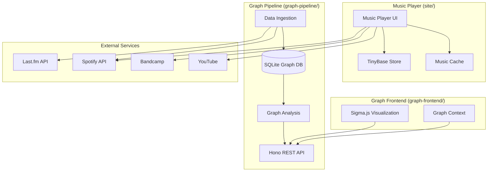

Rotations is composed of three distinct applications that work together to deliver a comprehensive music experience:

1. **Music player** (`site/`) — The primary web application for listening to music
2. **Graph pipeline** (`graph-pipeline/`) — Backend service for building listening history graphs
3. **Graph frontend** (`graph-frontend/`) — Interactive visualization of your listening patterns

## System architecture

## Component interactions

### Music player

The music player operates independently as a frontend-only application. It:

- Stores playlists and tracks locally in browser storage using TinyBase
- Streams audio from multiple sources (Bandcamp, YouTube, Spotify)
- Caches downloaded music in IndexedDB for offline playback
- Does not depend on the graph pipeline for core functionality

### Graph pipeline

The graph pipeline is a standalone backend service that:

- Ingests listening history from Last.fm and Spotify
- Constructs a directed weighted graph where nodes are songs and edges are sequential transitions
- Runs analysis algorithms (PageRank, clustering) on the graph
- Exposes a REST API for querying graph data
- Persists the graph in SQLite

### Graph frontend

The graph frontend is a visualization application that:

- Fetches graph data from the pipeline API
- Converts the graph to graphology format for rendering
- Uses Sigma.js to render an interactive network visualization
- Supports filtering, searching, and exploring listening patterns

## Data flow

<Tabs>
  <Tab title="Music playback">
    When you play music in the player:

    1. Player loads playlist from TinyBase store
    2. Player requests audio stream from source (Bandcamp/YouTube/Spotify)
    3. Audio is cached in IndexedDB for offline access
    4. Player state (current track, timestamp) is persisted to store
  </Tab>
  
  <Tab title="Graph generation">
    When building your listening history graph:

    1. Pipeline fetches scrobbles from Last.fm API
    2. Pipeline fetches recently played tracks from Spotify API
    3. Pipeline fetches all playlists from Spotify API
    4. Raw data is normalized to canonical `SongKey` format (`artist::track`)
    5. Graph builder creates nodes and weighted edges from sequential transitions
    6. Analysis enriches graph with PageRank scores and cluster IDs
    7. Graph is saved to SQLite database
  </Tab>
  
  <Tab title="Graph visualization">
    When viewing your listening graph:

    1. Frontend fetches graph JSON from pipeline API (`GET /graph`)
    2. Graph is converted to graphology format
    3. Sigma.js renders nodes and edges
    4. Layout algorithm (MDS or ForceAtlas2) positions nodes
    5. User interactions (filter, search, hover) update the visualization
  </Tab>
</Tabs>

## Technology stack

### Music player

- **Framework**: Astro (static site generation with React islands)
- **State management**: TinyBase (reactive data store with localStorage persistence)
- **Storage**: IndexedDB (music cache), localStorage (playlists and state)
- **UI**: React with Tailwind CSS

### Graph pipeline

- **Runtime**: Node.js with TypeScript
- **API framework**: Hono (lightweight HTTP server)
- **Database**: SQLite via better-sqlite3
- **Data sources**: Last.fm API, Spotify Web API

### Graph frontend

- **Framework**: React with TanStack Router
- **Visualization**: Sigma.js (WebGL graph rendering) with graphology
- **Layout**: Custom MDS implementation with weighted constraints
- **Build tool**: Vite

## Deployment architecture

Each component can be deployed independently:

<AccordionGroup>
  <Accordion title="Music player deployment">
    The music player is a static site that can be hosted on:
    - Vercel, Netlify, or any static hosting provider
    - GitHub Pages
    - Self-hosted with nginx or Apache

    No server-side runtime is required. All data is stored in the browser.
  </Accordion>

  <Accordion title="Graph pipeline deployment">
    The graph pipeline requires a Node.js runtime and can be deployed to:
    - VPS with PM2 or systemd
    - Docker container
    - Platform-as-a-Service (Railway, Render, Fly.io)

    The SQLite database file should be persisted in a volume or mounted directory.
  </Accordion>

  <Accordion title="Graph frontend deployment">
    The graph frontend is a static SPA that can be deployed to the same targets as the music player.

    You need to configure the API URL via the `VITE_GRAPH_API_URL` environment variable at build time.
  </Accordion>
</AccordionGroup>

## Design philosophy

### Separation of concerns

The three components are intentionally decoupled:

- You can use the music player without ever building a listening graph
- You can run the graph pipeline and visualization independently
- Each component has its own data model and storage layer

### Import-only music library

The music player follows an "import once, persist forever" model:

- Music is added manually by importing from sources
- Once imported, music lives in your browser's storage
- Automatic offline mode — streamed music is cached for later
- No cloud sync or server-side storage

### Graph as analysis layer

The listening history graph is purely an analysis tool:

- It does not affect music playback
- It provides insights into your listening patterns
- It enables discovery through network visualization
- It can be rebuilt at any time from source data

<Info>
  The music player and graph pipeline use different identifiers:
  - Music player: `TrackId` (e.g., `track-bandcamp-123`)
  - Graph pipeline: `SongKey` (e.g., `radiohead::paranoid android`)
  
  The graph pipeline can optionally link back to `TrackId` if the song exists in your local library.
</Info>

## Next steps

<CardGroup cols={3}>
  <Card title="Music player architecture" icon="play" href="/architecture/music-player">
    Deep dive into the frontend music player
  </Card>
  <Card title="Graph pipeline architecture" icon="diagram-project" href="/architecture/graph-pipeline">
    Learn how the listening graph is built
  </Card>
  <Card title="Data model" icon="database" href="/architecture/data-model">
    Understand types and data structures
  </Card>
</CardGroup>